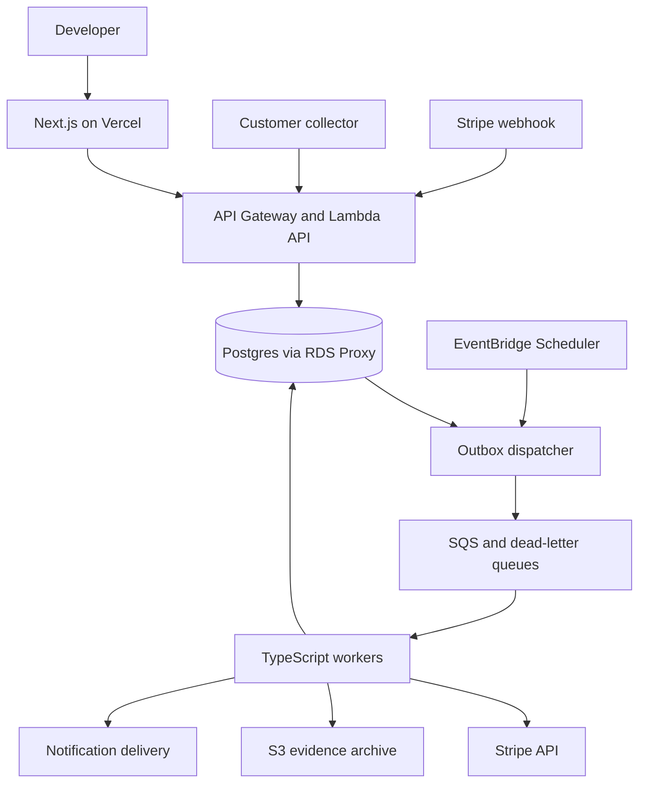

# Reconcile: product and technical specification

Proposed design, 17 September 2026, revision 2. This is a build plan, not an implementation or a claim of validated demand. The first customer is a small B2B SaaS team running Stripe Billing and Postgres with application-owned subscription/access logic. The initial commercial entry point is a billing or pricing migration audit, followed by continuous monitoring.

Revision 2 resolves the open questions from the first review. Key decisions: the collector polls for targeted recheck work so confirmation can use fresh application evidence; the engine returns per-account assessments with per-feature results; an *assessment run* pairs one Stripe inventory with one application inventory; a project is bound to exactly one environment; and the hackathon and first-customer-audit stages run entirely locally with no AWS account. AWS infrastructure appears only at the production pilot stage (§15).

## 1. Product promise and limits

Reconcile answers: **Do the capabilities our application grants agree with the commercial rules we intended to apply to each account?**

It compares three separate things:

1. Billing facts: subscriptions, prices, relevant invoices, effective dates, and cancellation state.
2. Customer-approved policies: which facts imply which entitlements, including trials, grace periods, and explicit exceptions.
3. Observed application state: stored account configuration or, with an adapter, the application's actual authorization decisions.

The core experience is an evidence-backed incident inbox. Each discrepancy has a subject, feature, expected value, observed value, policy version, source timestamps, persistence history, and suggested next action.

Do not advertise perfect billing, guaranteed revenue recovery, or access verification when only a database column has been inspected. A database adapter establishes stored-state correctness. An authorization adapter establishes decisions for the specific subject/resource/action contexts it evaluates; it does not prove every possible request path is correct. Show the scope of each check.

Stripe is authoritative for Stripe billing facts. It is not the sole authority for enterprise contracts, complimentary access, or application permissions. An active subscription is not universally equivalent to collected cash; invoice-based subscriptions can be active with an unpaid first invoice. [Stripe subscription lifecycle](https://docs.stripe.com/billing/subscriptions/overview)

## 2. First supported scope

Support one Stripe account per project, one application/account namespace, fixed subscription plans, explicit Stripe customer-to-application account mappings, and a Postgres-derived read model. A **project is bound to exactly one environment** (`live` or `test`) at creation and this cannot change; a workspace holds many projects. Every Stripe connection, collector token, identity link, policy and incident belongs to one project and therefore one environment.

"Fixed subscription plans" means: each supported subscription has exactly one subscription item, `quantity = 1`, and one recurring price. Subscriptions with multiple items, quantities above one, subscription schedules, metered prices or `pause_collection` set are **unsupported** and produce `unsupported_billing_model` (§4), never a guessed entitlement.

Supported subscription lifecycle states and the policy questions they raise:

| Stripe state | Default policy behavior (customer may override) |
|---|---|
| `trialing` | Entitled per plan; trial end is a scheduled transition |
| `active` | Entitled per plan |
| `past_due` | Entitled within a configurable grace period from the first failed invoice due date; not entitled after |
| `unpaid` | Not entitled |
| `canceled` (immediate) | Not entitled from `canceled_at` |
| `active` with `cancel_at_period_end` or `cancel_at` | Entitled until the effective time; that time is a scheduled transition |
| `incomplete`, `incomplete_expired` | Not entitled |
| `paused` or `pause_collection` set | Unsupported in the first release (`unsupported_billing_model`) |
| 100 % coupon / zero-value price | Entitled per plan; flag as `zero_value` in evidence so the associated amount is zero, not omitted |
| Customer object deleted | Subscription facts retained; account treated as having no live billing identity; open incidents resolve with reason `subject_removed` after confirmation |

Initial checks:

| Check | Required evidence | Product behavior |
|---|---|---|
| Expected feature missing | Confirmed plan mapping, applicable policy, fresh observed state | Candidate incident, then confirm after settling and recheck |
| Unexpected feature enabled | Complete relevant billing inventory plus policy and exceptions | Candidate incident; never infer misuse from absence alone |
| Wrong plan-derived feature set | Price mapping and configured feature set | Feature-level diff |
| Duplicate local subscription identity | Original local record identities and configured uniqueness rule | Data integrity incident; preserve duplicates before normalization |
| Missing or ambiguous account mapping | Source identifiers and mapping evidence | Coverage gap, not an access incident |
| Unknown price or unsupported billing model | Relevant source object and policy coverage | Coverage gap requiring configuration |
| Stale collector or failed inventory | Scan manifest, heartbeat, timestamps | Monitoring health incident |

Defer usage metering, seats/quantities, money movement, credit ledger correctness, tax, multi-provider billing, complex contract extraction, and autonomous repairs. Represent unsupported cases explicitly. Do not quietly apply simplistic rules to them.

Not every row in the table above is an engine result. Layer responsibilities:

| Check | Produced by |
|---|---|
| Expected feature missing, unexpected feature enabled, wrong feature set | Engine: `FeatureEvaluation` of kind `mismatch` |
| Duplicate local subscription identity | Engine: account-level `integrity` finding from `localBillingRecords` |
| Missing/ambiguous mapping, unknown price, unsupported billing model | Engine: `unknown` with reason codes; the worker's coverage step turns account-level unknowns into coverage-gap incidents |
| Stale collector, failed inventory | Dispatcher/scheduler health checks on `scan_runs` and manifests; never the engine |

For accounts with multiple Stripe customers, subscriptions, or products, require an explicit relationship and combination rule. The initial product may mark these accounts unsupported. Multiple subscriptions are not intrinsically duplicates.

## 3. User journey

### 3.1 Setup

1. Create a workspace and project. Select production or test environment.
2. Connect a restricted Stripe API credential. Required read permissions: Customers, Subscriptions, Products, Prices, Invoices. Stripe exposes no API to enumerate a restricted key's grants, so validation is by probe: one `list` call with `limit=1` per required object type, recording which succeeded. Mode (live/test) must match the project environment. Missing permissions are recorded as a coverage limitation on the connection.
3. Install a TypeScript collector in the customer's environment. It reads a deliberately limited view and pushes normalized observations, and polls for targeted recheck requests (§7). The hosted service does not need a customer database password.
3a. Optionally register a Stripe webhook endpoint. The customer creates it in the Stripe dashboard pointing at `POST /v1/webhooks/stripe/:connectionId` and pastes the signing secret into Reconcile, which stores it in Secrets Manager (production) or the local secrets file (local stages). Rotation is the same paste flow; the previous secret stays valid for 24 hours.
4. Configure identity mapping using stable IDs. Prefer existing `stripe_customer_id` references or reviewed metadata. Email-only matches can be suggestions but never automatic authoritative joins.
5. Map Stripe prices to named capabilities. Ask how trials, past-due subscriptions, scheduled cancellation, immediate cancellation, manual grants, and invoice terms should behave.
6. Preview policy results on example accounts. AI may draft a mapping; an authorized human publishes an immutable version.
7. Run a baseline scan. Show accounts assessed, mismatched, pending, unsupported, and stale. Show how many subjects are unmapped on each side.
8. Enable notifications after the baseline and its exceptions have been reviewed.

Set a pilot goal of setup within an hour with assistance, then work toward self-service setup under 20 minutes. These are targets, not promises.

### 3.1a Roles

| Role | May |
|---|---|
| viewer | Read overview, incidents, accounts, policies |
| operator | viewer + assign, acknowledge, recheck, snooze, mark externally remediated, export evidence, run scans |
| policy_publisher | operator + publish policy versions, create/expire exceptions, edit identity links |
| admin | policy_publisher + manage Stripe connections, collector tokens, webhooks, memberships, notification rules, workspace deletion |

Roles are per workspace membership. There is no per-project role in the first release.

### 3.2 Overview screen

Show last successful complete inventory, current source freshness, policy version, evaluated population, confirmed incidents, pending discrepancies, coverage gaps, and recent resolutions. Display a healthy indicator only for a clearly defined population with sufficiently recent evidence.

An **assessment run** is the unit the overview displays. It is the tuple (Stripe inventory run, application inventory run, published policy version, engine version, evaluation time). Evaluations, bucket counts and incidents reference the assessment, never a single inventory, because the two inventories complete at different times with independent generations (§9). A new assessment is created when either inventory completes or a policy is published; the most recent Stripe and application inventories that both have validated completion manifests are paired.

For a selected assessment, use disjoint account buckets, assigned in this precedence order: (1) confirmed mismatch; (2) pending mismatch; (3) incomplete, stale or unsupported (any account-level `unknown` reason, or a subject present in only one source without a reviewed explanation); (4) fully assessed with no mismatch. An account whose covered features all match but which has some uncovered features goes in bucket 4 with a partial-coverage badge; an account in bucket 1 or 2 with uncovered features also gets the badge. Display feature coverage separately as covered/uncovered feature counts across the population. Counts must reconcile to the enumerated union of application and billing subjects plus subjects of retained unresolved incidents. If either inventory manifest is missing, no assessment is created and the previous one is shown with a stale banner; the denominator is labeled a known minimum.

Do not turn associated contract value into claimed recovered revenue. At most display a clearly explained associated recurring amount, preserving currency and billing interval and excluding ambiguous allocations.

### 3.3 Incident inbox and detail

Inbox columns: account, check type, affected capability, first observed, last confirmed, assigned owner, severity, source freshness, and state. Filters: project, policy version, check, severity, owner, state, and account.

Severity is derived, not stored as truth, and recomputed when evidence changes:

| Condition | Severity |
|---|---|
| Unexpected feature enabled (access granted without billing basis) | high |
| Expected feature missing for an account with an active or trialing subscription | high |
| Expected feature missing for an account in grace period | medium |
| Wrong feature set where both plans are paid | medium |
| Duplicate local subscription identity | medium |
| Coverage gap (unmapped identity, unknown price, unsupported model) | low |
| Monitoring health (stale collector, failed inventory) | low, escalates to medium after two consecutive missed cadences |

Associated recurring amount does not change severity in the first release; it is shown alongside it.

Detail includes a plain-language title, expected/actual diff, evidence references, timeline, applicable policy, exception history, suggested investigation, and actions. Explain why the incident is confirmed. A cause inferred from event history is labeled a hypothesis unless supported by direct evidence.

Actions: assign, acknowledge, recheck, snooze notification, record a policy exception, export evidence, and mark externally remediated. An engineer clicking 'fixed' initiates verification; it does not make the incident verified resolved.

Incident states: `candidate`, `confirmed`, `acknowledged`, `remediation_claimed`, `resolved`, `superseded`. Resolution reasons: `verified_remediated` (fresh matching evidence), `subject_removed` (the account disappeared from the application inventory, or its Stripe customer was deleted, in two consecutive validated inventories), `policy_changed` (see below). Only `verified_remediated` counts as a technical fix in metrics.

Notification snoozing and commercial exceptions are different. Snoozing suppresses alerts temporarily. A commercial exception changes expected behavior and requires scope, reason, owner, and expiry. A discrepancy disappearing because policy changed is labeled accordingly, rather than credited as a technical fix.

### 3.4 Account view

Unify mapped billing identities, relevant subscriptions, observed access, expected access, exceptions, policy evaluations, open incidents, and change history. Record the observation method and its coverage. Avoid storing names, email addresses, payment details, or arbitrary Stripe metadata unless a specific feature requires them.

### 3.5 Policy editor

Provide a form editor backed by a versioned JSON schema. Model price-to-capability mappings, supported lifecycle rules, freshness and settling thresholds, and exceptions. Publishing requires a role with policy authority and a preview of affected accounts. Store author, timestamp, hash, and reason.

A policy change creates a new evaluation context. Compare old and new evaluations, but do not rewrite past evidence. Keep a stable logical rule ID across versions where meaning remains comparable.

Supersession rule: if the new version removes a rule ID, or changes the set of capabilities a rule ID grants, open incidents on that rule ID are marked `superseded` and re-evaluated as new candidates under the new version. If the rule ID survives with only threshold or timing changes (grace period length, settling interval), the open incident is kept and its next occurrence records the new policy version. A discrepancy that disappears under the new version resolves with reason `policy_changed`.

### 3.6 Migration audit

Capture a reviewed pre-migration cohort and baseline. Define planned price mappings and effective times. Track intended invariants before and after the change. Include newly observed or removed subjects explicitly; do not change the cohort silently.

Produce a report showing checked accounts, policy versions, time windows, discrepancies, exceptions, uncovered cases, and verification results. It is an operational verification report, not a compliance certification. Distinguish a policy simulation against current facts from historical reconstruction: the latter requires retained historical facts.

A migration audit pins its own retention: when the cohort baseline is captured, the full baseline assessment (observations, evidence, policy version) is written as an immutable bundle to the evidence archive and retained until the migration project is closed, independent of the default 30-day detailed-observation retention (§12).

## 4. Evaluation semantics

Use three output categories: match, mismatch, unknown. Unknown includes stale evidence, incomplete inventories, ambiguous identity, unsupported price, conflicting policies, and missing permissions. Pending is a workflow stage for a mismatch awaiting time and confirmation, not a fourth truth value.

The engine is a pure TypeScript package. It receives canonical billing facts, application observations, identity links, a published policy, explicit exceptions, coverage metadata, and an explicit evaluation time. It returns structured facts and reason codes. It performs no network requests and never consults a language model.

```ts
type UnknownReason =
  | 'unmapped_identity'        // no reviewed identity link, or collector and link disagree
  | 'ambiguous_identity'       // more than one candidate link
  | 'unsupported_policy'       // price not mapped in the published policy
  | 'unsupported_billing_model'// multi-item, quantity>1, schedule, metered, paused
  | 'stale_evidence'           // observation older than the freshness threshold
  | 'incomplete_inventory'     // no validated manifest for a source
  | 'connector_unavailable'    // source could not be read at all
  | 'conflicting_rules'        // policy rules disagree with no precedence
  | 'conflicting_exceptions'   // overlapping exceptions disagree
  | 'missing_permission'       // Stripe key lacks a needed object permission
  | 'unobserved_feature';      // feature absent from the observation (omitted = unknown)

type FeatureEvaluation =
  | { kind: 'match'; ruleId: string; feature: string; expected: boolean; evidenceIds: string[] }
  | { kind: 'mismatch'; ruleId: string; feature: string; expected: boolean; observed: boolean; evidenceIds: string[] }
  | { kind: 'unknown'; ruleId?: string; feature: string; reasons: UnknownReason[]; evidenceIds: string[] };

interface IntegrityFinding {
  kind: 'duplicate_local_identity';
  localRecordIds: string[];
  stripeSubscriptionId?: string;
  evidenceIds: string[];
}

interface AccountAssessment {
  accountId: string;                       // application account, or synthetic id for billing-only subjects
  policyVersion: string;
  engineVersion: string;
  evaluatedAt: string;                     // UTC instant supplied by the caller
  accountReasons: UnknownReason[];         // account-level unknowns (identity, inventory, connector)
  features: FeatureEvaluation[];           // one entry per capability in the policy
  integrity: IntegrityFinding[];
  nextTransitionAt?: string;               // earliest policy-relevant time (trial end, grace expiry,
                                           // cancellation effective, exception expiry)
}
```

An account-level reason applies to every feature: when `accountReasons` is non-empty, every entry in `features` is `unknown` and carries those reasons. `expected` on `match` is kept so that "matched as not entitled" and "matched as entitled" are distinguishable. `nextTransitionAt` is the engine's only forward-looking output; the scheduler uses it to queue due rechecks rather than re-deriving policy timing (§9).

This type covers boolean feature checks. Add separate typed checks for counts or money later; do not overload boolean checks with approximate numbers. Money uses integer minor units or exact decimal representations and explicit currencies. Timestamps use UTC instants, while merchant rules explicitly define business timezone boundaries if relevant.

Reconciliation procedure:

1. Build the subject population from both sources plus the subjects of retained unresolved incidents. A scan of active subscriptions alone misses former customers with lingering access and application accounts with no billing identity.
2. Validate inventory completeness, mapping uniqueness, known schema versions, and evidence freshness.
3. Derive expected entitlements from the approved policy. Apply documented exception precedence; unresolved conflicts produce unknown.
4. Compare expected values with observations for supported contexts.
5. Store a candidate discrepancy. Queue a targeted recheck: re-fetch the Stripe objects directly, and enqueue a collector work request for the affected accounts (§7). Confirmation requires a **fresh** observation from each source, meaning observed after the candidate was recorded and after the settling interval.
6. Where relevant facts changed during observation, defer confirmation and collect a new pair. Cross-system atomic snapshots are unavailable; this reduces ambiguity without pretending to remove it.
7. Open or update an incident only after the configured confirmation rule succeeds. Store each evidence revision.
8. Resolve after fresh matching evidence meets the resolution rule. An unavailable connector produces an unknown monitoring state and never automatically resolves old incidents.

Pilot defaults: candidate immediately; confirmed when a second observation pair, both observed at least five minutes after the candidate, still shows the mismatch. The **detection envelope** shown to the customer is `collector recheck latency + 5 minutes`, where recheck latency is the collector's configured poll interval in daemon mode or its cron cadence otherwise. A cron-only hourly collector therefore has a displayed envelope of roughly 65 minutes, not five. Display the configured envelope, actual evidence age, and last verified state.

Canonicalisation: before evaluation, observations from each source are keyed by `(source, subjectId)` and the entry with the highest `(sourceRevision, observationGeneration)` wins. Evaluation must therefore be independent of arrival order for identical canonical inputs, which is one of the property checks in §13.

Policy effective times and source versions matter. Persist a timestamp when a fact was observed, its source-reported effective time where available, and a local monotonically increasing observation generation. Arrival order alone is not truth.

## 5. Recommended technology stack

| Layer | Choice | Rationale |
|---|---|---|
| Language/runtime | TypeScript, current supported Node.js LTS compatible with selected AWS/Vercel runtimes | Shared contracts and engine |
| Local stages (hackathon, first audit) | Next.js dev server or CLI, Postgres in Docker (`docker compose`), in-process job runner, filesystem evidence archive, secrets in a git-ignored `.env` | Zero cloud cost; same packages as production |
| Web | Next.js App Router, React, Tailwind, accessible component primitives | Dashboard, forms, server rendering |
| Web hosting | Vercel | Frontend deployment and previews |
| Identity | Amazon Cognito through OIDC | User authentication; workspace authorization remains application-owned |
| HTTP backend | API Gateway HTTP API + TypeScript Lambda handlers | Stable public/worker API boundary |
| API contracts | Zod schemas, generated OpenAPI and TypeScript client | Validate every external boundary |
| Database | RDS PostgreSQL, Drizzle ORM plus explicit SQL migrations | Transactions, relational evidence and tenant isolation |
| DB connection management | RDS Proxy for production Lambda concurrency | Pooling and reduced connection pressure |
| Background jobs | SQS Standard with DLQs + Lambda | Bounded retriable work |
| Scheduling | EventBridge Scheduler | Kick off dispatch and periodic audits |
| Evidence archive | S3 with encryption, lifecycle rules and versioning where needed | Larger bounded scan artifacts |
| Credentials | Secrets Manager and KMS | Encryption and role-scoped access |
| AI helper | Small provider interface; Bedrock in the production pilot, any OpenAI-compatible or Anthropic API key (or a fixture-backed stub) in local stages | Schema suggestions and explanations; no decision authority |
| Infrastructure | AWS CDK in TypeScript | Reviewed repeatable infrastructure |
| Testing | Vitest, real Postgres integration tests, Playwright | Engine semantics, isolation, and product flows |
| Telemetry | CloudWatch plus OpenTelemetry instrumentation | Source freshness, job progress, latency and failures |

The database belongs to Reconcile. Customers' Postgres databases remain in their own environments. A push collector provides the bridge.

The AWS rows in the table apply to the production pilot only. `packages/db`, `packages/engine`, and the worker handlers are written against ports (`JobQueue`, `EvidenceArchive`, `SecretStore`, `Scheduler`) with two adapters each: a local adapter (Postgres table queue, filesystem, `.env`, in-process `setInterval`) and an AWS adapter (SQS, S3, Secrets Manager, EventBridge). Local adapters are the default; nothing in the repository requires AWS credentials to run, test or demo.

Rough production-pilot fixed monthly cost, single region, single-AZ, smallest viable sizes (order-of-magnitude estimates, verify against current pricing): RDS `db.t4g.micro` ~$15, NAT gateway ~$35 plus data, RDS Proxy ~$15 (per vCPU-hour minimum), Secrets Manager <$5, CloudWatch logs ~$5, S3 <$1, API Gateway/Lambda/SQS within free tier at pilot volume. Total roughly $75–100/month before RDS Proxy is decided (see §8). This is comparable to half of the proposed $199/month price for a single customer and is why local stages must not touch AWS.

Vercel handles the interface and short backend-for-frontend calls. Core jobs live on AWS. Vercel functions have execution limits; Lambda itself also has a maximum timeout, so jobs remain bounded, paginated, and resumable. [Vercel limits](https://vercel.com/docs/functions/limitations), [Lambda timeout](https://docs.aws.amazon.com/lambda/latest/dg/configuration-timeout.html)

Next.js server code should use a server-only API client. Authenticate every Server Action and Route Handler, enforce CSRF protections where applicable, and avoid shared caching of tenant data. Browser bundles never receive Stripe credentials or database secrets. [Next.js data security](https://nextjs.org/docs/app/guides/data-security)

## 6. Runtime topology



The diagram omits Cognito, KMS, secrets storage, and monitoring to keep the data flow readable. Scheduler dispatches recurring work and due rechecks; it does not hold the product's correctness state. That state resides in the database.

Put RDS in private subnets. Place database-using Lambdas behind appropriate VPC networking and allow database ingress only from their security groups through the proxy. Stripe/model access requires working outbound connectivity; use NAT for public API calls and suitable VPC endpoints for AWS services. Include RDS, proxy, NAT, secrets, logs, and evidence retention in the fixed-cost model. Low job volume does not make these costs disappear.

The Vercel application talks to the AWS API over HTTPS from server code only. It has no direct network path to the private database. The browser never calls API Gateway, so no CORS configuration exists on the API. The Next.js server holds the Cognito refresh token and access token in an encrypted, `httpOnly`, `SameSite=Lax` session cookie, refreshes the access token server-side when within two minutes of expiry, and forwards the access token as a bearer header to the API. The backend checks workspace membership and role for every operation.

Three route groups, three authorizers:

| Route group | Authentication | Enforcement point |
|---|---|---|
| `/v1/*` dashboard routes | Cognito access token, expected issuer/audience | API Gateway JWT authorizer, then handler role check |
| `/v1/inventories/*`, `/v1/collector/*` | Project-scoped collector token (`Authorization: Bearer rct_...`) | Lambda request authorizer that hashes the token and resolves the project; handler never reads a project ID from the body |
| `/v1/webhooks/stripe/:connectionId` | Stripe signature over raw bytes | No gateway authorizer; handler verifies before any parsing |

Each group has its own throttling and payload limits (collector pages capped at 1 MB and 500 accounts). [API Gateway JWT authorizers](https://docs.aws.amazon.com/apigateway/latest/developerguide/http-api-jwt-authorizer.html)

## 7. Collector and source contracts

### Application collector

Ship a small `@reconcile/collector` package and CLI. The actual name is provisional. Let customers supply a read-only iterator or adapt their existing authorization function. Do not execute arbitrary customer JavaScript inside the hosted service.

The collector runs in two modes: **cron** (one full inventory per invocation, then exit) and **daemon** (full inventory on a schedule plus polling `GET /v1/collector/work` every 60 seconds by default for targeted recheck requests, answered by pushing an incremental observation batch). Daemon mode is required for the sub-hour detection envelope; cron mode is acceptable for daily audits. Both modes are the same binary with different flags.

Collector constraints: supports the two most recent Node.js LTS lines; depends only on `packages/domain` and no other internal package; zero native dependencies; published to npm with provenance attestation; the customer's normalized export can be written to a local file with `--dry-run` for review before anything is sent.

```ts
interface LocalBillingRecord {
  localId: string;                // the customer's own row identity
  stripeSubscriptionId?: string;
  stripeCustomerId?: string;
  status?: string;                // raw, not interpreted
}

interface AccountObservation {
  accountId: string;
  stripeCustomerIds: string[];    // as stored by the application: evidence, not authority
  localBillingRecords: LocalBillingRecord[];
  observedAt: string;
  sourceRevision?: string;
  method: 'database_view' | 'authorization_adapter';
  access: Record<string, boolean>;
  contextsChecked?: Array<{
    subject: string;
    resource: string;
    action: string;
  }>;
}

interface InventoryPage {
  schemaVersion: 1;
  runId: string;
  pageId: string;
  sequence: number;
  contentHash: string;
  accounts: AccountObservation[];
}
```

Omitted `access` keys mean unknown, not false. `localBillingRecords` carries the raw local billing-record identities needed to detect duplicates; do not normalize those duplicates away into one account record before checking them. Two records in one account, or across accounts, sharing a `stripeSubscriptionId` is a duplicate-identity finding.

Identity precedence: `identity_links` (reviewed, §8) is authoritative. Collector-reported `stripeCustomerIds` are evidence. If an account has no reviewed link, the collector value becomes a *suggested* link and the account is `unmapped_identity`. If a reviewed link and the collector value disagree, the account is `unmapped_identity` with the disagreement attached as evidence; nothing is auto-relinked.

The ingestion protocol starts an inventory, submits bounded idempotent pages, then submits a completion manifest listing expected pages, row counts, checksums, scope, and snapshot consistency mode. A timed-out scan is incomplete. Only a validated completion manifest establishes membership for absence checks.

Prefer a short consistent database read for small inventories. For larger scans, use stable keyset pagination and a documented observation window; recheck candidates against fresh state. Do not hold a database transaction open while uploading pages. Stage locally before transfer when snapshot consistency is necessary. Full inventory and incremental update are distinct ingestion modes; incremental data cannot prove an account is absent.

Project-scoped collector tokens are separate from user login tokens and environment-scoped. Store token hashes, rotate them, and impose payload/page limits. Token identity selects the project; never trust a project ID supplied in the JSON body.

### Stripe collector

Pin a supported stable Stripe API version and SDK version in the connector; test upgrades before changing either. Store the API version with evidence.

Fetch the required subscription inventory including canceled subscriptions using the documented status filter; handle every pagination boundary, including nested lists when relevant. The API's default list omits canceled subscriptions. Subscriptions whose customer object is deleted are still listed and are retained as facts; the population builder marks the subject as having no live billing identity (§2). Test-clock subscriptions in test-mode projects are included and tagged with their clock ID. [Stripe list subscriptions](https://docs.stripe.com/api/subscriptions/list)

Start with reviewed restricted read credentials and only the object permissions the enabled checks need. Customer-granted read permissions do not authorize automated webhook creation; registration is a separate customer configuration step initially. [Stripe API keys](https://docs.stripe.com/keys)

Use full scans periodically and event-triggered targeted retrieval between them. Do not assume replaying webhooks alone reconstructs a complete historical ledger or current account inventory. Retrieve subscriptions for application-linked Stripe identities too, even if they were absent from the latest candidate set.

Enforce a shared per-connection request budget with bounded concurrency, retry/backoff/jitter, and fair dispatch across tenants. Respect response rate-limit information and leave headroom for the customer's own application. A worker-local limiter alone does not constrain many parallel workers. A Postgres-backed dispatch lease and next-eligible time are sufficient for an early low-throughput system. [Stripe rate limits](https://docs.stripe.com/rate-limits)

### Webhook ingestion

Verify signatures against the original raw request bytes before processing. Derive tenant/account routing from the verified connection configuration. Deduplicate using connection/account, environment, and event ID.

Atomically persist the inbox event and an outbox work request; return success only after durable acceptance. A separate dispatcher publishes outbox records to SQS and retries unsent records. Marking 'seen' must not be confused with processing completion. Duplicate delivery must leave the original durable work eligible to finish.

Treat event bodies as context and targeted-refresh signals. Re-fetch current relevant source facts; Stripe does not guarantee event ordering and can deliver duplicates. [Stripe webhooks](https://docs.stripe.com/webhooks)

## 8. Storage model

Every tenant-owned table includes `workspace_id`, and relevant tables also include `project_id` and `environment`. Foreign keys and uniqueness constraints include tenant context so identities cannot cross namespaces.

| Table/group | Main purpose |
|---|---|
| workspaces, memberships, projects | Ownership, roles, environment boundaries |
| connections, collector_tokens | Source identity, secret references, permissions and health |
| identity_links | Reviewed account-to-billing identity relationships |
| policy_versions, policy_exceptions | Immutable published rules and scoped grants |
| scan_runs, scan_pages, manifests | Checkpoints, completeness, counts and observation windows |
| observations, observation_heads | Immutable normalized evidence plus latest eligible references |
| evaluations | Engine result, policy hash, evidence IDs, reason codes and engine version |
| incidents, incident_occurrences | Stable incident identity and evolving evidence/lifecycle |
| inbox_events, jobs, outbox | Durable ingestion, leases, retries and publication |
| notifications | Delivery attempts, deduplication keys and failure state |
| audit_events | Policy, membership, credential and incident actions |
| idempotency_keys | `(workspace_id, key)` → request hash, response, expiry; 24 h TTL |
| assessments | Pairing of Stripe and application inventory runs with policy and engine version (§3.2) |
| notification_rules | Per project: check types, minimum severity, states, channel |
| repair_requests | Later: approved commands, preconditions and verification |

Use JSONB for source-specific facts and structured evidence; keep frequently queried identifiers, timestamps, status, and ownership as typed indexed columns. Avoid a generic entity-attribute-value model.

Maintain append-only evidence within a declared retention period. Store unchanged normalized payloads by content hash and keep compact check observations pointing to them, rather than copying entire Stripe objects on every pass. S3 holds larger compressed manifests or evidence bundles; Postgres holds searchable metadata and hashes. A hash helps detect changes but is not a claim of legally tamper-proof evidence.

An incident fingerprint includes tenant, project, environment, account, stable rule ID, and capability/context. Keep policy/evidence versions on occurrences. A material policy meaning change can supersede an incident; distinguish this from verified remediation. A partial unique index or transactional locking prevents duplicate open incidents.

Use Postgres row-level security as defense in depth. Set tenant context transaction-locally with `SELECT set_config('app.workspace_id', $1, true)` as the first statement of every transaction, and use a non-owner application role without bypass privileges. Workers establish tenant context from trusted job records. Test this explicitly. Parameterize queries and use allowlisted customer views; avoid unrestricted model-generated SQL.

RDS Proxy and RLS: I believe RDS Proxy pins a connection to a session when it sees session-state changes such as `SET`, which would defeat pooling. Whether `set_config(..., true)` (transaction-local) triggers pinning must be confirmed by a one-day spike before the production pilot. Decision rule: if pinning occurs, drop RDS Proxy and instead cap database-using Lambda reserved concurrency at 10 with a per-container `pg` pool of one connection; at pilot volume this is sufficient and saves the Proxy cost. RDS Proxy is therefore *optional* in the CDK stack.

## 9. Job reliability and consistency

Keep one job bounded to a page or small account batch. Commit observations, checkpoint progress, and required follow-on outbox work in one transaction. A crash before commit retries the job. A crash after commit but before queue acknowledgment results in duplicate delivery, handled by job identity and transactional uniqueness.

SQS and Lambda can deliver/process messages multiple times. Implement idempotency and partial batch failure handling; configure visibility timeouts for real worker duration and a DLQ with a deliberate redrive procedure. [SQS at-least-once delivery](https://docs.aws.amazon.com/AWSSimpleQueueService/latest/SQSDeveloperGuide/standard-queues-at-least-once-delivery.html), [Lambda with SQS](https://docs.aws.amazon.com/lambda/latest/dg/with-sqs.html)

Use job leases with expiry and fencing generations to prevent expired workers from overwriting newer observations. A late page cannot update the current head over a newer completed source revision. Periodic dispatch recovers expired jobs, due scans, due confirmation checks, and unsent outbox entries.

Do not implement exactly-once external notification promises. Use stable notification IDs and provider idempotency if supported; record retries and accept that some downstream APIs leave an ambiguous delivery outcome. Database incidents should remain unique even if an alert is delivered twice.

Time-based transitions require scheduled work even if no webhook arrives: trial end, grace expiry, cancellation effective time, and exception expiry. The engine reports these as `nextTransitionAt` on each `AccountAssessment`; the worker writes a due-recheck job for that time. The scheduler does not derive policy timing itself. When the job runs it revalidates source state rather than assuming the transition happened.

## 10. APIs and frontend implementation

Initial endpoints:

| Endpoint | Behavior |
|---|---|
| POST /v1/projects | Create project/environment configuration |
| POST /v1/connections/stripe | Validate/store a credential; redact it from responses and logs |
| POST /v1/inventories | Start collector inventory |
| PUT /v1/inventories/:id/pages/:pageId | Idempotent bounded page submission |
| POST /v1/inventories/:id/complete | Validate completion manifest |
| POST /v1/policies/preview | Evaluate proposed policy without activation |
| POST /v1/policies/publish | Create approved policy version |
| POST /v1/scans | Queue an audit, return 202 and run ID |
| GET /v1/scans/:id | Progress, coverage and completeness |
| GET /v1/incidents | Tenant-scoped filtered cursor pagination |
| GET /v1/incidents/:id | Evidence and history |
| POST /v1/incidents/:id/recheck | Queue a Stripe re-fetch and a collector work request for the account |
| GET /v1/collector/work | Collector token only: list pending targeted recheck requests for the project |
| POST /v1/inventories/incremental | Collector token only: push targeted observations answering work requests |
| POST /v1/exceptions | Create reviewed scoped exception |
| POST /v1/webhooks/stripe/:connectionId | Signature-verified event receiver |

All mutating operations need authorization and appropriate idempotency/revision protection. Every `POST` accepts an `Idempotency-Key` header (UUID, required for the collector and the BFF, which generates one per user action); the key, request hash and response are stored in `idempotency_keys` for 24 hours and a replay with a different hash returns `409`. Publication uses an `expectedRevision` field so concurrent editors cannot silently overwrite configuration. Page IDs with different hashes are rejected as conflicts.

Use server-rendered initial pages and client components for the incident table, filters, policy forms, and scan progress. Poll a bounded scan-status endpoint while work runs; avoid WebSockets in the pilot. Export evidence through short-lived signed URLs authorized for the current workspace.

Reuse domain schemas across the web, API, SDK, and workers, while keeping credentials and server-only code out of client bundles. Publish OpenAPI for the customer-facing collector contract. Zod validates inputs; TypeScript alone is not runtime validation.

## 11. AI assistance

Provide three optional actions: suggest mappings; explain a structured incident; draft an investigation or repair proposal. The engine's decision remains available if the model is offline.

Send schema metadata and minimal redacted example values. Treat source metadata and descriptions as untrusted input. Use a strict output schema and validate referenced fields and evidence IDs against the provided context. Do not allow model text to grant access, change policies, run SQL, or trigger repairs.

Persist prompt/template version, model identifier, structured inputs or their approved redacted references, output, and user acceptance. Explanations should cite specific evidence IDs; if the evidence only establishes a mismatch, describe possible causes as hypotheses.

AI's strongest initial role is reducing setup friction across different customer schemas. The evaluation engine is independently useful without AI. Avoid a generic chat panel until incident-specific assistance is good.

## 12. Security and trust boundary

Reconcile can expose who is entitled to sensitive capabilities, so tenant isolation and limited collection are product requirements. Keep card/payment details out of the data model. Store Stripe secrets in Secrets Manager, enforce IAM access by function responsibility, redact logs, encrypt data in transit and at rest, and log credential access and configuration changes.

The push collector reduces database exposure and SSRF risk from arbitrary customer database hosts. Its normalized export should be reviewed by the customer. For a later pull integration, implement explicit network destination restrictions and a dedicated security design; never simply let users enter a URL and have a privileged worker fetch it.

Define retention and deletion for evidence, source metadata, secrets and backups. Pilot default: 30 days of detailed observations, 13 months of incident occurrences with their evidence IDs and hashes, indefinite minimal incident summaries until workspace deletion. Migration audits pin their baseline bundle for the life of the migration project (§3.6). Show when retained evidence is no longer available. Workspace deletion must cancel schedules/work, invalidate tokens, revoke stored credentials, and delete retained data according to the published policy.

Keep production and preview environments separate. Vercel previews use synthetic data and test credentials; they do not point at production projects. Use short-lived CI deployment identity and scoped AWS roles.

## 13. Verification and operating metrics

Meaningful engine fixtures: current paid access, permitted trial, past-due within/outside grace, scheduled cancellation before/after effective time, immediate cancellation, zero-value plan, invoice terms, unknown price, expired exception, conflicting overrides, multiple subscriptions, missing local record, duplicate local records, and unmapped identity.

Failure tests: duplicate and reordered events; crash between DB commit and queue acknowledgment; crash during outbox publishing; missing inventory page; changing records during pagination; stale collector; revoked Stripe permission; rate limiting; failed Slack/email delivery; policy publication during a scan; expired worker overwriting current state; and cross-tenant reads/writes.

Property checks (fast-check with Vitest): processing the same event twice does not create duplicate incidents; permuting ingestion order does not change results for identical canonical inputs (canonicalisation rule in §4); incomplete data never establishes absence; unknown observations never silently become false; a non-empty `accountReasons` implies every feature is `unknown`; and a failed scan never changes an incident to verified resolved.

Use real Postgres integration tests for constraints, RLS, transaction-local tenant context, and outbox recovery. Use Stripe test mode for connector contract tests, with explicit handling of test-clock subscriptions where used. Use Playwright for connect/map/preview/scan/inspect/recheck flows. Load-test a representative subscription population and measure request amplification, DB connections and evidence growth.

Track time to first completed trustworthy audit, actionable-finding precision confirmed by users, collector freshness, inventory completion rate, confirmation delay, pending job age, outbox age, DLQ depth, rate-limit responses, API calls per assessed account, bytes per observation, incident notification duplicates, and support time per workspace. No universal zero-false-positive or instant-detection claim.

## 14. Repository and deployment structure

Use a pnpm workspace. Start with logical modules, not separately deployed services for every domain.

| Path | Contents |
|---|---|
| apps/web | Next.js app deployed to Vercel |
| apps/api | Lambda HTTP handlers |
| apps/workers | Collect, evaluate, confirm, publish and notify handlers |
| packages/domain | Canonical types and Zod schemas |
| packages/engine | Pure policy and comparison functions |
| packages/stripe-connector | API version adapter and normalization |
| packages/collector | Customer SDK/CLI and view adapters |
| packages/db | Drizzle schema, explicit migrations, repository helpers |
| packages/api-client | Generated client/contracts |
| packages/fixtures | Synthetic policies, observations and incidents |
| infra | CDK stacks and environment configuration |

Dependency direction (enforced with a workspace lint rule): `domain` depends on nothing internal; `engine` and `collector` depend only on `domain`; `stripe-connector`, `db`, `api-client` depend on `domain`; `apps/*` depend on anything. No package may import from `apps/*`.

Pin dependencies in a lockfile. CI runs type checks, engine tests, database isolation tests (Postgres service container), and build checks. CI needs no AWS credentials until the production pilot adds a CDK synth check. Use expand/contract schema migrations: deploy additive schema changes before code depends on them, and remove old fields only after all workers have rolled forward. Version jobs and ingestion contracts so deployments do not strand queued work.

Manage AWS infrastructure with CDK TypeScript. Start one region, one Postgres database, and a few queues. Add independent services, Fargate workers, Redis, or workflow orchestration only when measured workload and reliability requirements justify them. RDS Proxy is useful for Lambda connection management but is an additional running cost. [AWS CDK](https://docs.aws.amazon.com/cdk/v2/guide/home.html), [RDS Proxy](https://docs.aws.amazon.com/AmazonRDS/latest/UserGuide/rds-proxy.html), [Drizzle](https://orm.drizzle.team/docs/overview)

## 15. Build stages

### One-hour hackathon

**No AWS account, no Vercel deployment, no database.** Deliver a locally run Next.js demo (`pnpm dev`) with synthetic JSON fixtures in `packages/fixtures`. Use the same `packages/engine` and `packages/domain` intended for production; the web app imports the engine directly and reads fixtures from disk. The policy fixture is hand-written and committed. The AI mapping step is optional: if an API key for any supported provider is present it makes one call to suggest a price-to-feature mapping; otherwise a fixture-backed stub returns a canned suggestion, and the demo says so. A human confirms the mapping and the deterministic scan distinguishes a true mismatch, a valid grace-period exception, stale evidence, and an unmapped identity. Show evidence detail and a recheck after editing the fixture. Label simulated sources clearly.

Suggested allocation: 10 minutes on fixtures and schema; 15 on engine; 15 on dashboard and detail; 10 on AI mapping and confirmation; 10 on ambiguous-case tests and rehearsal.

### First real customer audit

Still no AWS. Build the collector/CLI, real Stripe adapter, explicit policy configuration, and a repeatable report, running against Postgres in Docker with the local adapters for queue, archive, secrets and scheduling. Run in the customer's environment if that lowers access friction. Learn from actual account mappings and exceptions before building elaborate onboarding. A small team might reach this in several focused days, depending on existing scaffolding and customer complexity.

### Production pilot

This is the first stage that creates an AWS account and a Vercel project. Begin with the RDS Proxy/RLS spike (§8) and a cost review against the estimate in §5. Then implement authentication/tenant isolation, AWS adapters for the ports defined in §5, complete inventories, secret handling, immutable evidence, the incident lifecycle, recurring scans, coverage reporting, notifications, and the failure tests above.

Notifications in the pilot: Slack incoming webhook and email (SES) as channels; a `notification_rules` row per project selects check types, minimum severity and states (`confirmed` and `resolved` by default). Coverage-gap and health incidents notify at most once per day per project as a digest. Several weeks is a more honest planning range than treating the demo as production-ready; the estimate depends heavily on integration and security requirements.

Start daily full inventories with more frequent targeted checks only where fresh application observations are available. Improve frequency after measuring API limits and customer needs. Establish operational alerts and restore procedures before charging for continuous coverage.

### Subsequent product

Add migration reports, policy-change impact previews, authorization adapters, agent/MCP access to evidence, then reviewed repairs. Repairs use customer-defined application commands with preconditions, idempotency keys, authorization, expiry and post-action verification. Re-read before executing. External effects may not be reversible; do not describe a blanket rollback guarantee.

Expand to seats, credits or usage-to-invoice checks only after recurring demand. These checks need different fact models and should be treated as product additions, not a universal equality comparison.

## 16. Commercial validation and implementation priorities

The initial company hypothesis is continuous verification of revenue-related application behavior. Sell an assisted migration or billing-integrity audit, then a monthly monitoring pilot. Pricing proposals such as $199/month are experiments, not market facts.

The first engineering priority is an accurate, explicit result with honest coverage. The second is repeatable onboarding. The third is reliable recurring operation. A polished dashboard with ambiguous identity matching or incomplete inventories would not substantiate the product promise.

Before expanding, seek evidence that customers keep monitoring after their initial issue is fixed, that a common connector and policy model serve several customers, that meaningful findings recur, and that support costs decline per account. If every installation requires custom integration work indefinitely, price and operate it as a service until the repeatable product emerges.

## Primary references

- [Stripe subscription lifecycle](https://docs.stripe.com/billing/subscriptions/overview)
- [Stripe subscription listing and canceled-status coverage](https://docs.stripe.com/api/subscriptions/list)
- [Stripe webhook delivery, ordering, signatures and duplicates](https://docs.stripe.com/webhooks)
- [Stripe rate limits](https://docs.stripe.com/rate-limits)
- [Stripe API credentials](https://docs.stripe.com/keys)
- [Next.js data security](https://nextjs.org/docs/app/guides/data-security)
- [Vercel function limits](https://vercel.com/docs/functions/limitations)
- [Lambda maximum execution time](https://docs.aws.amazon.com/lambda/latest/dg/configuration-timeout.html)
- [SQS at-least-once delivery](https://docs.aws.amazon.com/AWSSimpleQueueService/latest/SQSDeveloperGuide/standard-queues-at-least-once-delivery.html)
- [Lambda and SQS processing](https://docs.aws.amazon.com/lambda/latest/dg/with-sqs.html)
- [EventBridge Scheduler](https://docs.aws.amazon.com/scheduler/latest/UserGuide/what-is-scheduler.html)
- [API Gateway JWT authorizers](https://docs.aws.amazon.com/apigateway/latest/developerguide/http-api-jwt-authorizer.html)
- [RDS Proxy](https://docs.aws.amazon.com/AmazonRDS/latest/UserGuide/rds-proxy.html)
- [AWS CDK TypeScript infrastructure](https://docs.aws.amazon.com/cdk/v2/guide/home.html)
- [Drizzle ORM](https://orm.drizzle.team/docs/overview)
